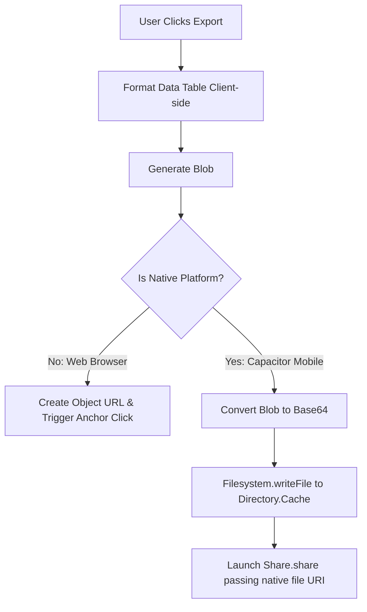

# Saarlekha — Technical & Architectural Specifications

This document serves as the comprehensive, single source of truth for the **Saarlekha** operations reporting platform. It outlines the system architecture, database design, modules, business logic, calculations, and security configurations implemented across the repository.

---

## 1. System Architecture

Saarlekha is designed as a secure, multi-tenant operations logging and metrics dashboard for manufacturing enterprises. It runs as a responsive web app and is wrapped into a native mobile app using Capacitor.

```mermaid
graph TD
    subgraph Client (Web & Mobile PWA)
        FE[React + Vite + TypeScript]
        Cap[Capacitor Wrapper]
        FE --> Cap
    end

    subgraph API & Services
        BE[Node.js + Express API Server]
        Auth[JWT / OAuth Handler]
        Prisma[Prisma ORM]
    end

    subgraph Database Layer
        DB[(PostgreSQL Database)]
        RLS[Row-Level Security Policies]
    end

    FE -->|HTTP / REST| BE
    BE -->|Query Context| Auth
    BE -->|Parameterized SQL| Prisma
    Prisma -->|set_config GUC| DB
    DB --> RLS
```

### 1.1 Frontend Stack
- **Framework**: React (v19) + Vite (v8) + TypeScript.
- **Styling**: Tailwind CSS, breakpoint-driven responsive layout supporting desktop screens (persistent left sidebar, wide tables, dynamic panels) down to mobile screens (bottom navigation tab bar, full-screen sheets, cards instead of tables).
- **Core Library Dependencies**:
  - `react-router-dom` (v7) for secure route guard configurations.
  - `lucide-react` for iconography.
  - `xlsx` for Excel workbook creation.
  - `jspdf` & `jspdf-autotable` for client-side PDF rendering.
- **Mobile Native Bridge**: Capacitor (v8) using core plugins:
  - `@capacitor/filesystem`: File write operations to local device directories.
  - `@capacitor/share`: System-level Share Sheet launcher.

### 1.2 Backend Stack
- **Runtime & Framework**: Node.js + Express + TypeScript.
- **Database Connector**: Prisma ORM (v5+) with PostgreSQL.
- **Authentication**: JWT (JSON Web Tokens) with manual Email/Password sign-ins and Google OAuth 2.0.

### 1.3 Database & Infrastructure
- **DBMS**: PostgreSQL (v16).
- **Multi-Tenant Mode**: Shared database, single schema. Every tenant-scoped table contains a `company_id` column, enforced by PostgreSQL **Row-Level Security (RLS)** at the database engine level.

---

## 2. Multi-Tenancy & Row-Level Security (RLS)

Data isolation is enforced at the database query execution level. The application uses PostgreSQL RLS policies to guarantee that Company A can never read or write Company B's data, even if an application filter fails.

### 2.1 Tenant Context Setup
The backend establishes the RLS tenant context inside a database transaction by setting a local session configuration variable (GUC):

```sql
SET LOCAL app.current_tenant_id = 'tenant-uuid-here';
```

In Prisma, this is executed within transaction blocks to avoid connection pool context bleed:

```typescript
export async function getTenantPrisma(tenantId: string) {
  const prisma = new PrismaClient();
  return prisma.$transaction(async (tx) => {
    await tx.$executeRawUnsafe(`SET LOCAL app.current_tenant_id = '${tenantId}'`);
    return tx;
  });
}
```

To prevent **SQL Injection**, all GUC setters are strictly parameterized when utilizing raw query binds.

### 2.2 RLS Policies
RLS is enabled on all tenant-scoped tables:
- `Company`, `User`, `Department`, `Manpower`, `Customer`, `Item`, `JobOrder`, `ReportFormat`, `ReportEntry`, `Machine`, `MaintenanceRecord`, `ProductionRecord`, `AuditLogEntry`, `Token`.

#### Read and Write Policies (`WITH CHECK`)
All write operations (`INSERT`, `UPDATE`, `DELETE`) require that the row being modified matches the session's active tenant ID.

```sql
-- Example policy for Customer table
CREATE POLICY customer_tenant_policy ON "Customer"
  FOR ALL
  USING (company_id = NULLIF(current_setting('app.current_tenant_id', true), '')::uuid)
  WITH CHECK (company_id = NULLIF(current_setting('app.current_tenant_id', true), '')::uuid);
```

#### Pre-Authentication Exception
During user login, email verification, or password setup, the tenant ID is not yet resolved in the session. RLS handles these operations securely by checking if the queried user's identifier matches context parameters set in the GUC during the transaction:

```sql
-- User table read policy allowing pre-auth lookup
CREATE POLICY user_login_policy ON "User"
  FOR SELECT
  USING (
    company_id = NULLIF(current_setting('app.current_tenant_id', true), '')::uuid
    OR email = current_setting('app.login_email', true)
    OR google_id = current_setting('app.login_google_id', true)
    OR id = NULLIF(current_setting('app.login_user_id', true), '')::uuid
  );
```

---

## 3. Auth, Onboarding & Permissions

### 3.1 Dual-Auth Methods
1. **Manual Email/Password**:
   - Passwords are encrypted using **bcrypt** with a cost factor of **12**.
   - Requires email verification. Login attempts for unverified accounts are blocked with a `403 Forbidden` error.
2. **Google OAuth 2.0**:
   - Uses ID tokens sent to `/api/auth/google`.
   - **Account Linking**: If a user signs up manually and later logs in via Google with the same email, the accounts are merged (the `google_id` is written to the existing `User` record). Similarly, if they sign in via Google first and later register manually, they set a password for the existing record.

### 3.2 Onboarding Workflow
1. **Super Admin** onboard a new Company by supplying details (excluding passwords).
2. The backend provisions the company record, generates a secure, single-use `INVITE` token, and saves it in the `Token` table.
3. The onboarding response exposes the invite link: `https://app.saarlekha.com/setup-password?token=...`.
4. The admin shares the invite link using the device's native sharing sheet.
5. The invited administrator opens the link, sets their password, and activates their account.

### 3.3 Roles & Capabilities Matrix

| Feature / Action | Super Admin | Company Admin | Operations |
|---|---|---|---|
| Create/Edit Companies | ✅ | ❌ | ❌ |
| Create Admins / Users | Super Admins & Company Admins | Operations Users Only | ❌ |
| Assign Departments | ✅ | ✅ | ❌ |
| Customize Fields (Formats) | ✅ | ✅ | ❌ |
| Approve Items | ✅ | ✅ | ❌ |
| Create Items (Pending) | ✅ | ✅ | ✅ (Saved as *Pending*) |
| Log Data Entries | ✅ | ✅ | ✅ |
| View Dashboards | ✅ (All Tenants) | ✅ (Tenant-wide) | ✅ (Assigned Depts Only) |
| Access Audit Logs | ✅ | ✅ | ❌ |

---

## 4. Feature & Module Deep Dive

### 4.1 Dynamic Report Builder & Fields Schema
Instead of rigid tables, report formats are defined as JSON structures (`ReportFormat` model) containing a schema array of dynamic fields.

#### Field Schema Structure:
```typescript
interface FieldDefinition {
  id: string;
  name: string;
  type: 'text' | 'number' | 'date' | 'dropdown' | 'yes_no' | 'photo' | 'calculated' | 'operator' | 'machine';
  unit?: string;
  options?: string[]; // Used for dropdown types
  formula?: string;   // Used for calculated types
  isSystem?: boolean; // Protects static fields
}
```

- **Calculated (Formula) Fields**: Computed on the fly. Supported operators: `+`, `-`, `*`, `/`. The system replaces variable tokens (matching other fields) with their runtime numeric values:
  - Example: `[Production Count] * [Unit Weight]`
- **Preservation of Historical Data**: Modifying or deleting a field in a format does **not** corrupt older logs. When a format is saved, a new version is incremented. Existing `ReportEntry` records map to the format schema version active at their time of creation, preserving historical audits.
- **Drag-and-Drop Reordering**: Supported in local state via HTML5 Drag and Drop events, allowing users to resequence columns before committing writes.

### 4.2 Job Orders Master
- **Automatic Numbering Sequence**: Job orders are sequentially numbered as `JO-XXXXX` (e.g. `JO-00001`, `JO-00002`). The sequence is scoped per company, calculated inside a database transaction by querying the highest sequential ID for the active tenant.
- **Permissions & Workflow Locking**:
  - Operations can view the Job Orders table. However, they can only modify custom columns flagged as `"open": true` by the administrator.
  - When a Job Order's status transitions to `COMPLETED` or `CANCELLED`, the record locks. The backend rejects any further `PUT` requests for that ID from operations roles (`403 Forbidden`).

### 4.3 Items Master (Approval Pipeline)
- Operations can register new items in the master database. These are saved with a status of `PENDING` and are filtered out from selection dropdowns.
- Admins review pending items from a queue and can either `APPROVE` (marking them `ACTIVE` and selectable) or `REJECT` them.

### 4.4 Manpower Master & Aadhaar Encryption
- **Aadhaar Masking**: Aadhaar numbers are stored securely and **never** exposed in plaintext.
- **Implementation**:
  - The plaintext value is masked in the frontend (`XXXX XXXX 1234`) and encrypted before database storage.
  - Only the last 4 digits remain searchable/visible.
  - Exports, prints, and dashboard logs are filtered to only display the masked string.

### 4.5 Machine Maintenance Builder
- Uses the same dynamic schema engine as the Report Builder, scoped to maintenance events.
- Features standard columns (Machine Name, Maintenance Date, Status, Type) combined with custom, format-defined attributes.

---

## 5. Calculations & Algorithms

### 5.1 Summed-then-Divided Efficiency
To calculate operator or machine efficiency across a date range:

$$\text{Efficiency \%} = \frac{\sum \text{Daily Production Quantity}}{\sum \text{Daily Target Quantity}} \times 100$$

- **Algorithm Constraints**:
  - Targets and production figures are accumulated individually across all logging entries inside the period **first**, then divided.
  - If the sum of targets is $\le 0$, the calculation returns `'N/A'` to prevent division by zero errors.
  - The value is uncapped (can exceed $100\%$ to represent over-performance).

### 5.2 Case-Insensitive Field Key Matching
Because custom schemas allow arbitrary titles (e.g., `Production achieved (mtr.)`), the sync parser runs a regex normalizer:
1. Converts the key string to lowercase.
2. Strips non-alphanumeric characters.
3. Matches using `startsWith` logic.
- Example: `"PRODUCTION Achieved (Mtrs)"` $\to$ `"productionachievedmtrs"`, matching the pattern `"production"`.

---

## 6. Exporters & Mobile Share Sheet

Saarlekha features client-side exports supporting **Excel (.xlsx)**, **PDF**, **CSV**, and **TXT** formats.



### 6.1 Native Share Implementation
Standard browser downloads using simulated clicks on blob URLs fail inside an Android/iOS WebView wrapper because the engine restricts direct file downloads.
To resolve this:
1. **Base64 Conversion**: The file blob is read as a Data URL and stripped to its base64 payload.
2. **Local Caching**: The file is written to the device's native cache directory using the Capacitor Filesystem API.
3. **Native Sharing**: The native file URI returned by the write operation is passed to the Capacitor Share API, launching the system-level Share Sheet (allowing sharing via WhatsApp, Email, Drive, or Slack).

---

## 7. Security Configurations & Access Controls

- **Audit Trails**: All modifications, creations, and deletions are recorded in an append-only `AuditLogEntry` table capturing: timestamp, user ID, company ID, action type (`CREATE`, `EDIT`, `DELETE`, `APPROVE`), entity type, and delta snapshots (`before` and `after` states).
- **SQL Injection Prevention**: Forced parameterization of dynamic database configurations.
- **Secure User Deletion**: When an admin deletes a user, the system runs a database transaction clearing their `UserDepartment` relations. If they have active entries, the system soft-deactivates the account (scrambling password hash, renaming email to release the address, and marking them inactive) to preserve historical reports and audit trails.
- **Aadhaar Masking**: Aadhaar fields are strictly masked and encrypted. The raw string is never returned in public JSON payloads.

---

## 8. Directory Map

Key files across the project:

```
Saarlekha/
├── backend/
│   ├── prisma/
│   │   └── schema.prisma         # Database models and relations
│   ├── src/
│   │   ├── middleware/
│   │   │   └── auth.ts           # JWT and RLS Session setup
│   │   ├── routes/
│   │   │   ├── auth.ts           # Login, Invite, Reset, and Google OAuth
│   │   │   ├── dashboard.ts      # KPI aggregation and efficiency calculator
│   │   │   ├── reports.ts        # Report entries, templates, and batch submissions
│   │   │   └── jobOrders.ts      # Job order sequential numbering and permissions
│   │   └── utils/
│   │       ├── db-errors.ts      # SQL/RLS error sanitizer
│   │       └── efficiency.ts     # Summed-then-divided calculator
│   └── docker-compose.yml        # Development environment container spec
│
└── frontend/
    ├── src/
    │   ├── components/
    │   │   └── Layout.tsx        # Responsive layout and navigation
    │   ├── pages/
    │   │   ├── Dashboard.tsx     # Dashboard summary and scrolled cards
    │   │   ├── masters/
    │   │   │   ├── JobOrderMaster.tsx # Sequential job orders list
    │   │   │   └── ItemsMaster.tsx    # Item approval pipeline
    │   │   └── reports/
    │   │       ├── ReportBuilder.tsx  # Dynamic schema builder
    │   │       └── DataEntry.tsx      # Batch operations data logger
    │   └── utils/
    │       ├── api.ts            # Axios configuration
    │       └── export.tsx        # Excel/PDF/CSV/TXT generator & Share Sheet bridge
    ├── capacitor.config.ts       # Capacitor project configurations
    └── package.json              # Client dependencies including Capacitor plugins
```
